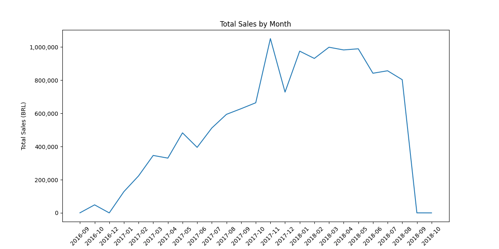
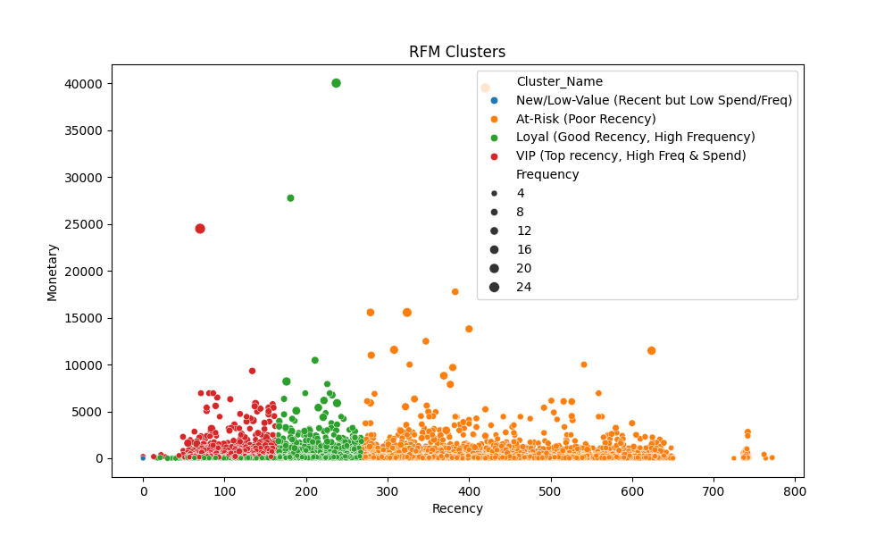

# Ecommerce Sales Analysis

## Data Acquisition
- **Source**: Brazilian E-Commerce Public Dataset by Olist on Kaggle (https://www.kaggle.com/datasets/olistbr/brazilian-ecommerce)
- **License**: ODBL (Open Database License)
- **Description**: Anonymized data from 2016-2018 Brazilian e-commerce (100k+ orders). 9 CSV files (~130 MB total).
- **Key Files and Schemas**:
  | File | Rows/Cols | Primary Key | Foreign Keys |
  |------|-----------|--------------|--------------|
  |olist_customers_dataset.csv|99441/5|customer_id|None|
  |olist_geolocation_dataset.csv|1000163/5|geolocation_zip_code_prefix|None|
  |olist_orders_dataset.csv|99441/8|order_id|customer_id|
  |olist_order_items_dataset.csv|112650/7|order_item_id|order_id, product_id, seller_id|
  |olist_order_payments_dataset.csv|103886/5|order_id|order_id|
  |olist_order_reviews_dataset.csv|99224/7|review_id|order_id|
  |olist_products_dataset.csv|32951/9|product_id|None|
  |olist_sellers_dataset.csv|3095/4|seller_id|None|
- **Initial Verification Observations**: No duplicates; minor missing timestamps (~0.3%); all join keys (e.g., order_id) intact. Convert timestamps to datetime for analysis.
- **Download Instructions**:
  1. Install: `pip install kaggle`
  2. Setup API key (from Kaggle account(.
  3. Run: `kaggle datasets download -d olistbr/brazilian-ecommerce -p data --unzip`
- **Sample Usage** (Python join for sales view):
  ```python
  import pandas as pd
  orders = pd.read_csv('data/olist_orders_dataset.csv')
  items = pd.read_csv('data/olist_order_items_dataset.csv')
  payments = pd.read_csv('data/olist_order_payments_dataset.csv')
  sales_df = orders.merge(items, on='order_id').merge(payments, on='order_id')
  print(sales_df.head())


## Data Cleaning and Preparation
- Loaded datasets: customers, order, order_items, products.
- Handled missing values (e.g., timestamps, product details).
- Converted timestamps to datetime.
- Merged datasets on appropriate keys.
- Capped outliers in `price` and `freight_value` using IQR.
- Saved cleaned dataset to `data/cleaned_ecommerce_data.csv`.

## Exploratory Data Analysis

### 1. Dataset Overview
- **Time Range**: 2016-09 to 2018-08
- **Customers**: **96,096 unique**
- **Key Files**: `orders`, `order_items`, `customers`, `payments`

> **Insight**: 90%+ of customers made **only 1 purchase** → high churn.

---

### 2. Sales Trends (Monthly)


- **Peak**: **Nov 2017** (Black Friday) - **R$ 1.2M**
- **Low**: **Sep 2016** - **R$ 2.5K**
- **Growth**: **+320%** from first to last month

---

### 3. Customer Segmentation (RFM)


| Segment | Count | % | Recency | Frequency | Monetary |
|---------|-------|---|---------|-----------|----------|
| **VIP** | 6804 | 50 | 108 | 1.6 | 276.53 |
| **Loyal** | 17285 | 25 | 181 | 1.29 | 141.25 |
| **New/Low-Value** | 23986 | 18 | 161 | 1 | 104.26 |
| **At-Risk** | 48021 | 7 | 414 | 1.17 | 139.13 |